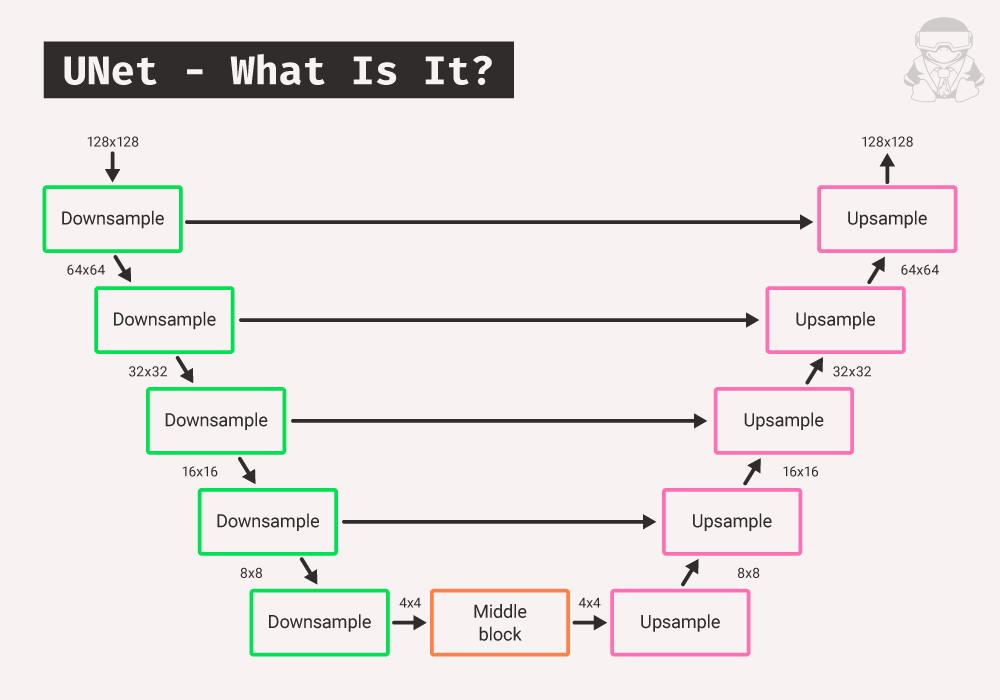

# Diffuion-model
A heavy diffusion model using the UNET architecture to generate 128x128 images of the desired dataset

image credit:https://eviltux.com/2024/08/11/training-a-u-net-model-from-scratch/

